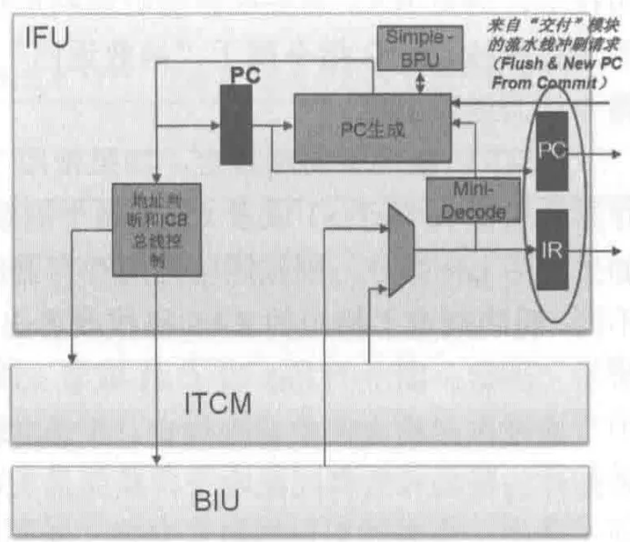

# 蜂鸟E203核学习

蜂鸟E203处理器，作为芯来科技开发的一款开源RISC-V处理器，有着极低功耗和极小面积的特点。根据实际测量，其功耗与面积均优于同级别的ARM Cortex-M核。蜂鸟E203处理器核还采用了一套统一的Verilog RTL编码风格，使用标准DFF模块例化并生成寄存器，除此之外，还使用了Verilog中的assign语法代替了if-else和case语法。

鉴于以上优点，将基于胡振波老师编写的《手把手教你RISC-V CPU处理器设计》和蜂鸟E203的Github开源项目（[蜂鸟E203](https://github.com/riscv-mcu/e203_hbirdv2/tree/master)）进行一个大致的学习分析。

# 1、取指模块IFU

在流水线处理器中，几乎所有处理器流水线的第一级都是从存储器中取出需要用到的指令，即取指（Instruction Fetch）。取指阶段是处理器执行指令的基础，处理器只有从内存中获得到正确的指令和数据，才能进行接下来的译码、执行等等阶段。因此，这个阶段在流水线架构中显得至关重要，直接影响到后续阶段的执行效率。

为了同时满足**低功耗**和**性能**的要求，取值模块必须要快且准确的取出相应的指令。

为了同时满足“快”与“准确”的特点，对于非分支指令，处理器必须要按照顺序将指令从存储器中取出；对于分支指令，必须进行**分支预测**准确的判断分支是否跳转以及跳转地址并根据地址取出相应的指令。由于该处理器使用的较为简单的静态分支预测，所以分支预测的相关复杂知识暂不介绍。

蜂鸟E203处理器的译码模块（IFU）的微架构如下所示：



在该模块中，核心是PC生成模块。Mini-Decode模块对从ITCM/BIU取出来的指令进行简单的译码操作，分辨该指令是分支指令还是普通指令。Simple-BPU模块则是对分支指令进行了简单的分支预测并对PC生成进行指导。PC生成模块最终根据输入的当前PC值，分支预测、迷你译码器的结果和来自“交付”模块的流水线冲刷请求来生成下一条待取指令的PC值。地址和总线控制模块根据得到的PC值去访问ITCM和BIU得到最终的指令并放入指令寄存器（IR）中。

## 1.1、Mini-Decode模块

从上方的微架构图中可以看出，Mini-Decode模块，即简单译码模块主要用于对从存储器中取出的指令码进行简单的译码操作。该模块实例化了一个在执行（EX）阶段使用的译码器（Decode）模块，通过将不相关的输入信号置零，不相关的输出信号悬空使得综合工具将不需要的无关逻辑优化掉。这种方法一方面使得只需要维护一份译码模块的代码，另一方面使得实际面积减小。

相关的重要代码在`rtl/e203/core/e203_ifu_minidec.v` 中：

```verilog
module e203_ifu_minidec(

  //////////////////////////////////////////////////////////////
  // The IR stage to Decoder
  input  [`E203_INSTR_SIZE-1:0] instr,

  //////////////////////////////////////////////////////////////
  // The Decoded Info-Bus
  ...

  );

  e203_exu_decode u_e203_exu_decode(

  .i_instr(instr),
  .i_pc(`E203_PC_SIZE'b0),
  .i_prdt_taken(1'b0),
  .i_muldiv_b2b(1'b0),

  .i_misalgn (1'b0),
  .i_buserr  (1'b0),

  .dbg_mode  (1'b0),

  .dec_misalgn(),
  .dec_buserr(),
  .dec_ilegl(),

  .dec_rs1x0(),
  .dec_rs2x0(),
  .dec_rs1en(dec_rs1en),
  .dec_rs2en(dec_rs2en),
  .dec_rdwen(),
  .dec_rs1idx(dec_rs1idx),
  .dec_rs2idx(dec_rs2idx),
  .dec_rdidx(),
  .dec_info(),
  .dec_imm(),
  .dec_pc(),

  ...

  .dec_mulhsu(dec_mulhsu),
  .dec_mul   (dec_mul   ),
  .dec_div   (dec_div   ),
  .dec_rem   (dec_rem   ),
  .dec_divu  (dec_divu  ),
  .dec_remu  (dec_remu  ),

  .dec_rv32(dec_rv32),
  .dec_bjp (dec_bjp ),
  .dec_jal (dec_jal ),
  .dec_jalr(dec_jalr),
  .dec_bxx (dec_bxx ),

  .dec_jalr_rs1idx(dec_jalr_rs1idx),
  .dec_bjp_imm    (dec_bjp_imm    )
  );

endmodule
```

该模块代码较为简单，主要就是对输入的`instr` 进行译码操作，通过例化`u_e203_exu_decode` 中的组合逻辑在一个周期内即可完成对该指令类型如`mul`,`div`,`rem`,`bjp`,`jal`,`jalr`等的判断。例如当前指令为`jal` 指令，则会使得输出信号`dec_jal` 为高电平，从而完成对指令类型的判断。

```verilog
...
wire rv32_jal      = opcode_6_5_11 & opcode_4_2_011 & opcode_1_0_11;
...
assign dec_jal     = rv32_jal    | rv16_jal  | rv16_j;
```

最终，这些指令类型相关的信号会被送入`litebpu` 中对下一部分的分支预测进行控制。

## 1.2、Simple-BPU分支预测

该处理器的分支预测模块位于`rtl/e203/core/e203_ifu_litebpu.v` 中，如其名称所示，是一个轻量化的分支预测模块，仅仅采用了最简单的静态预测而未采用其他的高级动态预测技术。关于高级分支预测的具体介绍，可以参考这两篇文章以及维基百科：

[现代中央处理器（CPU）是怎样进行分支预测的？ - 知乎 (zhihu.com)](https://www.zhihu.com/question/486239354/answer/3245281606)

[CPU分支预测算法（基础篇） - 知乎 (zhihu.com)](https://zhuanlan.zhihu.com/p/602635898)

[https://en.wikipedia.org/wiki/Branch_predictor](https://en.wikipedia.org/wiki/Branch_predictor)

### 1.2.1、静态分支预测

静态分支预测是最简单的分支预测技术，它不依赖于指令执行的动态历史信息，仅仅依赖于分支指令本身进行预测。一般来说，静态分支预测有两种，分别是预测所有的分支跳转或者所有的分支不跳转，将所有分支预测为跳转的情况下，准确率将超过50%，但是这对于商用的处理器来说不太够用。因此，该处理器采用了一种更复杂的静态预测，即假定向后的分支将会发生，向前的分支不会发生，这种预测有助于配合经常出现的程序的循环控制结构。在RISC-V的spec中，也提到了可以采用这种静态的分支预测：

> Software should also assume that backward branches will be predicted taken and forward branches as not taken, at least the first time they are encountered.

除此之外，还有依靠软件的静态分支预测方法，通过编译器的提示，让CPU可以判断出分支是否跳转。

按照指令中是否包含跳转地址，可以将分支指令分为直接跳转和间接跳转；按照指令是否一定会跳转，可以将分支指令分为条件分支指令和无条件分支指令。

### 1.2.2、无条件直接跳转指令

可以先对较为简单的无条件跳转指令进行分析，常见的无条件跳转指令有`jal`、`jalr` 等，由于无条件跳转指令一定会发生跳转，因此无须对其进行分支预测。

对于无条件直接跳转指令`jal`来说，litebpu模块直接将其PC值与指令中立即数表示的偏移量相加，得到其最终的目标地址，其指令解析如下：


相关的源代码如下所示：

```verilog
...
assign prdt_taken   = (dec_jal | dec_jalr | (dec_bxx & dec_bjp_imm[`E203_XLEN-1]));
...
assign prdt_pc_add_op1 = (dec_bxx | dec_jal) ? pc[`E203_PC_SIZE-1:0]
                       : (dec_jalr & dec_jalr_rs1x0) ? `E203_PC_SIZE'b0
                       : (dec_jalr & dec_jalr_rs1x1) ? rf2bpu_x1[`E203_PC_SIZE-1:0]
                       : rf2bpu_rs1[`E203_PC_SIZE-1:0];

assign prdt_pc_add_op2 = dec_bjp_imm[`E203_PC_SIZE-1:0];
...
```

该简单分支预测模块需要完成对下一条指令的PC值的预测，因此，对于无条件跳转指令`jal`来说，只需要将当前PC值与该指令中给出的立即数偏移相加即可得到最终的结果。其中，指令立即数`dec_bjp_imm` 信号从`minidec.v` 模块中传入。为了节省面积，所以所有的PC值的计算将共享同一个加法器，PC值计算的最终结果将在`ifetch.v` 中给出。

### 1.2.3、无条件间接跳转指令

无条件间接跳转指令`jalr` 同样也是一定会跳转的指令，同样无需预测其是否跳转，只需要对其跳转地址进行预测。但是，对于`jalr`指令来说，需要跳转的地址偏移值位于寄存器`rs1` 中，因此在得到最终的加法器操作数2之前，需要先从寄存器堆中读取操作由`rs1`索引的寄存器。对于`jalr`指令的具体描述如下所示：


由于该处理器的流水线为两级流水线，所以执行模块（EXU）和取值模块（IFU）可能会对同一个寄存器进行读写操作，此时就会形成写后读（RAW）的数据相关性（Data dependence）。对RAW数据相关性进行处理一般有数据前递（forward）、流水线暂停等方法。该处理器采取的是流水线暂停的方法。

流水线暂停是处理写后读数据冲突的一种方式，其解决思路是让需要结果的指令在取值阶段一直等待直到产生结果的指令写回到寄存器堆，才可以进入下一流水级。这种方法的核心是判定处于不同流水线阶段的指令是否会产生写后读（RAW）数据关系，并根据对应流水线的级数产生数个周期（通常为1-3个周期）的空指令（nop）。该处理器核的流水线级数为2级流水线，指令的运行如下图所示，因此只需要一个周期的空指令即可。


以上方右侧图片为例，从取指模块的视角进行分析，当运行到周期`t2`时，指令1（inst1）与指令2（inst2）有写后读（RAW）数据相关性。此时，取指模块会检测出数据相关性并停止下一周期`t3`的取指操作，直到没有指令间没有数据相关性。该操作等效于在`inst2`处插入了一个空指令并将`inst3`替换为`inst2`。该操作的具体代码实现如下：

```verilog
...
assign prdt_taken   = (dec_jal | dec_jalr | (dec_bxx & dec_bjp_imm[`E203_XLEN-1]));

wire dec_jalr_rs1x0 = (dec_jalr_rs1idx == `E203_RFIDX_WIDTH'd0);
wire dec_jalr_rs1x1 = (dec_jalr_rs1idx == `E203_RFIDX_WIDTH'd1);
wire dec_jalr_rs1xn = (~dec_jalr_rs1x0) & (~dec_jalr_rs1x1);
//数据依赖的判断
wire jalr_rs1x1_dep = dec_i_valid & dec_jalr & dec_jalr_rs1x1 & ((~oitf_empty) | (jalr_rs1idx_cam_irrdidx));
wire jalr_rs1xn_dep = dec_i_valid & dec_jalr & dec_jalr_rs1xn & ((~oitf_empty) | (~ir_empty));

wire jalr_rs1xn_dep_ir_clr = (jalr_rs1xn_dep & oitf_empty & (~ir_empty)) & (ir_valid_clr | (~ir_rs1en));

//xn寄存器资源冲突和读端口的检测
wire rs1xn_rdrf_r;
wire rs1xn_rdrf_set = (~rs1xn_rdrf_r) & dec_i_valid & dec_jalr & dec_jalr_rs1xn & ((~jalr_rs1xn_dep) | jalr_rs1xn_dep_ir_clr);
wire rs1xn_rdrf_clr = rs1xn_rdrf_r;
wire rs1xn_rdrf_ena = rs1xn_rdrf_set |   rs1xn_rdrf_clr;
wire rs1xn_rdrf_nxt = rs1xn_rdrf_set | (~rs1xn_rdrf_clr);

sirv_gnrl_dfflr #(1) rs1xn_rdrf_dfflrs(rs1xn_rdrf_ena, rs1xn_rdrf_nxt, rs1xn_rdrf_r, clk, rst_n);

assign bpu2rf_rs1_ena = rs1xn_rdrf_set;
//等待信号
assign bpu_wait = jalr_rs1x1_dep | jalr_rs1xn_dep | rs1xn_rdrf_set;

assign prdt_pc_add_op1 = (dec_bxx | dec_jal) ? pc[`E203_PC_SIZE-1:0]
                       : (dec_jalr & dec_jalr_rs1x0) ? `E203_PC_SIZE'b0
                       : (dec_jalr & dec_jalr_rs1x1) ? rf2bpu_x1[`E203_PC_SIZE-1:0]
                       : rf2bpu_rs1[`E203_PC_SIZE-1:0];

assign prdt_pc_add_op2 = dec_bjp_imm[`E203_PC_SIZE-1:0];
...
```

蜂鸟E203处理器根据`rs1`的索引值采取了不同的方案。

由于在RISC-V指令集中，通常将`x0` 寄存器的值设置恒为0，因此，当索引值为`x0` 寄存器时，无需从寄存器组中读取，直接将`prdt_pc_add_op1`的值设为零。

根据RISC-V手册的规定，`x1` 号寄存器通常用于返回地址。当索引值为`x1` 号寄存器时，意味着该寄存器将被频繁的写入，所以E203处理器会通过**将`x1`号寄存器从寄存器堆中单独引出（`rf2bpu_x1`）**来对这种情况进行单独的加速。

为了防止正在EXU中执行的指令需要写回`x1`号寄存器从而产生RAW数据相关性，`litebpu`模块需要保证OITF为空且当前指令不会写回`x1`号寄存器。当OITF不为空（当前有长指令正在执行）或IR指令寄存器（上一条指令）写回目标寄存器的索引为`x1`号寄存器时，`litebpu`模块会将`bpu_wait`信号拉高，此信号将阻止IFU生成下一个待取的PC值，因此，会出现**一个周期**的空泡。

同样，为了防止写回`xn`号寄存器产生RAW数据相关性，`litebpu`模块需要确保当前的EXU中没有任何指令正在执行，即OITF和IR寄存器都为空。此外，为了从寄存器`xn`中读取数据，需要判断第一个读端口是否空闲，且不存在资源冲突。判断逻辑使用了一个D触发器，其各信号的意义如下：

- `rs1xn_rdrf_r` ：表示了当前寄存器堆第一个读端口的读取状态，空闲时置低电平。
- `rs1xn_rdrf_set`：向寄存器端口一发起读取请求，读取时拉高。
- `rs1xn_rdrf_clr`：清除读取信号操作，确保读取状态的复位。
- `rs1xn_rdrf_ena`：D触发器使能信号，用于读取状态的更新。
- `rs1xn_rdrf_nxt`：下一周期的读取状态。

当需要读取`xn`号寄存器且寄存器读端口当前状态为空闲状态时，`rs1xn_rdrf_r` 为低，`rs1xn_rdrf_set`读取请求信号为高，`rs1xn_rdrf_clr` 清除信号为低，`rs1xn_rdrf_ena` 触发器使能信号为高，`rs1xn_rdrf_nxt` 下一周期读取信号为高。代表了读端口的使能信号将在**下一周期**拉高，加法器操作数也将在**下一周期**得出。

来到下一周期，当前指令为读取`xn`号寄存器且寄存器读端口当前状态为忙状态，`rs1xn_rdrf_r` 为高，`rs1xn_rdrf_set`读取请求信号为低，`rs1xn_rdrf_clr` 清除信号为高，`rs1xn_rdrf_ena` 触发器使能信号为高，`rs1xn_rdrf_nxt` 下一周期读取信号为低。代表了读端口的使能信号将在**下一周期**拉低，即状态的复位。

因此，`jalr`指令读取`xn`号寄存器时，会产生一个周期的空泡，并在两个周期（当前周期加等待周期）内基于D触发器完成了对`xn`号寄存器的读取与复位操作。

### 1.2.4、条件直接跳转指令

对于条件直接跳转指令（`bxx`），根据之前的分析，需要使用静态分支预测的方法。其源代码较为简单，如下所示：

```verilog
...
  // The JAL and JALR is always jump, bxxx backward is predicted as taken
  assign prdt_taken   = (dec_jal | dec_jalr | (dec_bxx & dec_bjp_imm[`E203_XLEN-1]));
...
  assign prdt_pc_add_op1 = (dec_bxx | dec_jal) ? pc[`E203_PC_SIZE-1:0]
                         : (dec_jalr & dec_jalr_rs1x0) ? `E203_PC_SIZE'b0
                         : (dec_jalr & dec_jalr_rs1x1) ? rf2bpu_x1[`E203_PC_SIZE-1:0]
                         : rf2bpu_rs1[`E203_PC_SIZE-1:0];
...
```

为了判断是向前跳转还是向后跳转，可以观察`dec_bjp_imm` 的符号位即最高位。如果符号位为1，代表该立即数为负数，意味着向后跳转，预测为需要跳转。最终将当前PC值与立即数值相加即可得到跳转的地址。

## 1.3、PC值生成

PC值生成逻辑用于生成下一条待取指令的PC值，根据当前指令的不同情况，采取不同的处理方式。相关的源代码如下所示：

```verilog
...
  wire [2:0] pc_incr_ofst = minidec_rv32 ? 3'd4 : 3'd2;

  wire [`E203_PC_SIZE-1:0] pc_nxt_pre;
  wire [`E203_PC_SIZE-1:0] pc_nxt;

  wire bjp_req = minidec_bjp & prdt_taken;

  wire ifetch_replay_req;

  wire [`E203_PC_SIZE-1:0] pc_add_op1 =
                            `ifndef E203_TIMING_BOOST//}
                               pipe_flush_req  ? pipe_flush_add_op1 :
                               dly_pipe_flush_req  ? pc_r :
                            `endif//}
                               ifetch_replay_req  ? pc_r :
                               bjp_req ? prdt_pc_add_op1    :
                               ifu_reset_req   ? pc_rtvec :
                                                 pc_r;

  wire [`E203_PC_SIZE-1:0] pc_add_op2 =
                            `ifndef E203_TIMING_BOOST//}
                               pipe_flush_req  ? pipe_flush_add_op2 :
                               dly_pipe_flush_req  ? `E203_PC_SIZE'b0 :
                            `endif//}
                               ifetch_replay_req  ? `E203_PC_SIZE'b0 :
                               bjp_req ? prdt_pc_add_op2    :
                               ifu_reset_req   ? `E203_PC_SIZE'b0 :
                                                 pc_incr_ofst ;

  assign ifu_req_seq = (~pipe_flush_req_real) & (~ifu_reset_req) & (~ifetch_replay_req) & (~bjp_req);
  assign ifu_req_seq_rv32 = minidec_rv32;
  assign ifu_req_last_pc = pc_r;

  assign pc_nxt_pre = pc_add_op1 + pc_add_op2;
  `ifndef E203_TIMING_BOOST//}
  assign pc_nxt = {pc_nxt_pre[`E203_PC_SIZE-1:1],1'b0};
  `else//}{
  assign pc_nxt =
               pipe_flush_req ? {pipe_flush_pc[`E203_PC_SIZE-1:1],1'b0} :
               dly_pipe_flush_req ? {pc_r[`E203_PC_SIZE-1:1],1'b0} :
               {pc_nxt_pre[`E203_PC_SIZE-1:1],1'b0};
  `endif//}
...
```

常见的情况共有四种，分别是流水线冲刷后取指、分支指令后取指、复位后取指和顺序取指。

对于流水线冲刷后取指的情况，`pipe_flush_req`信号为高，因此，将会使用从EXU送过来的新的PC值`pipe_flush_pc`，并将最低位置0以确保跳转的地址是对齐的。

对于分支指令后取指的情况，`bjp_req`信号为高，因此，会将从BPU预测得来的加法操作数1`prdt_pc_add_op1`与加法操作数2`prdt_pc_add_op2`相加得到最终需要跳转的地址。同样，这个地址也需要对齐。

对于第三种情况，即复位后取指，`ifu_reset_req`信号为高，因此，会将`pc_rtvec`作为PC跳转的地址，该信号在`rtl/e203/perips/sirv_aon_wrapper.v`中被定义，当`aon_io_bootrom`信号为高电平时，PC 的复位向量被设置为`0x0000_1000`，否则为`0x2000_0000`。

对于最后一种情况，即顺序取指的情况，则需要根据当前指令是16位指令还是32位指令判断自增值`pc_incr_ofst`。如果当前指令为16位指令，则下一条指令的PC值为当前PC值加2；如果当前指令为32位指令，则下一条指令的PC值为当前PC值加4。

## 1.4、访问存储器ITCM

# 2、执行模块EXU
