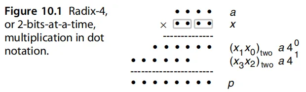
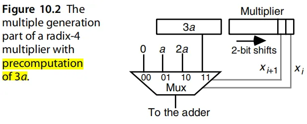
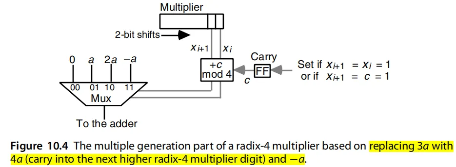
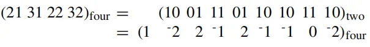
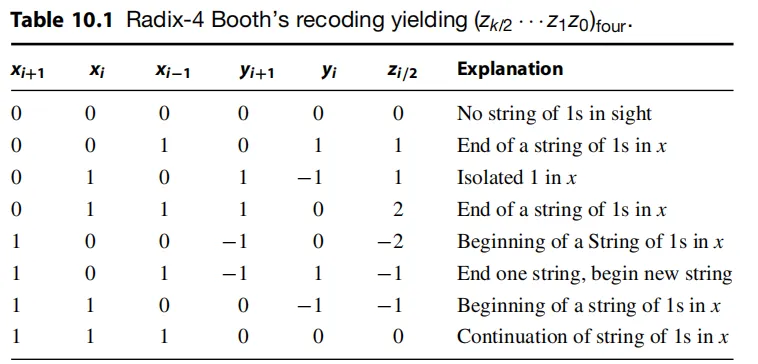
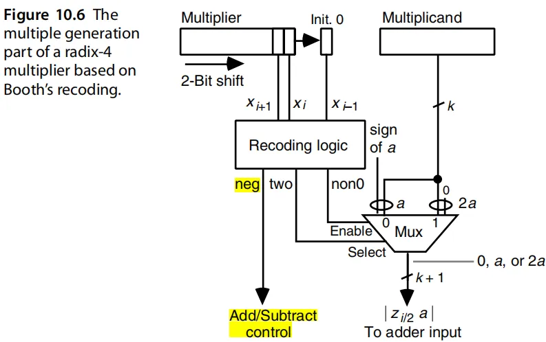
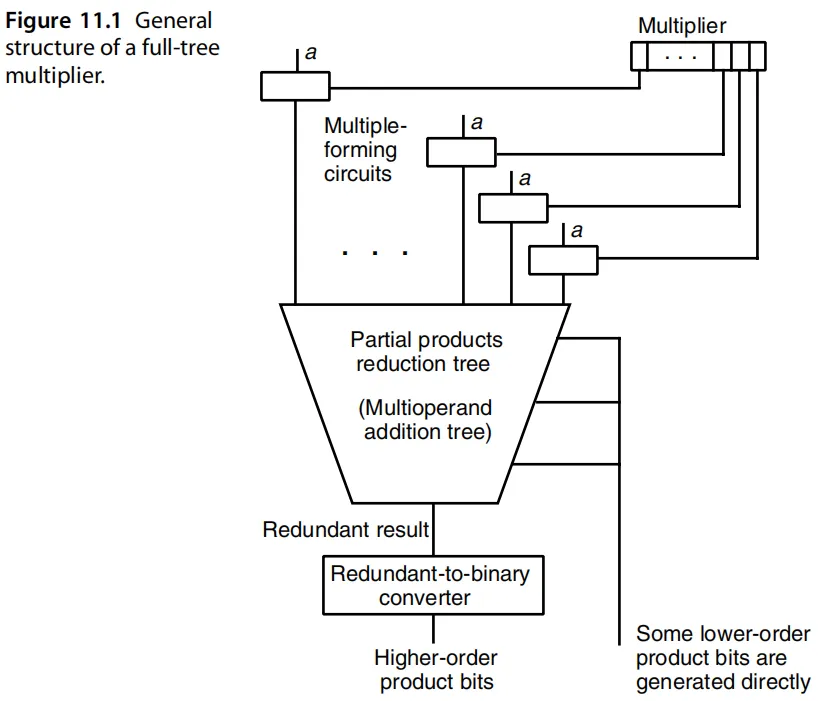
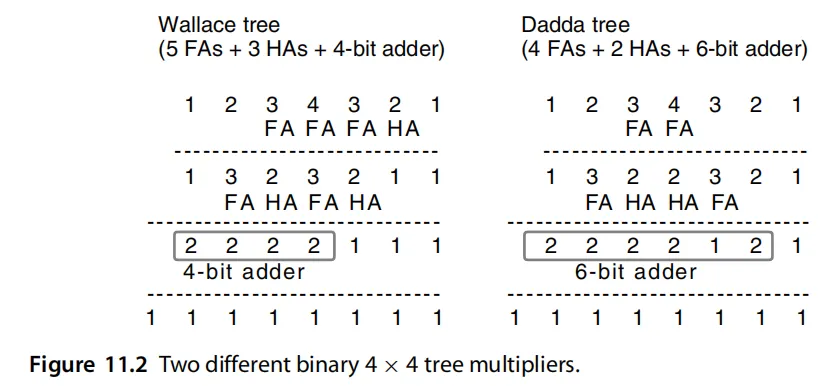
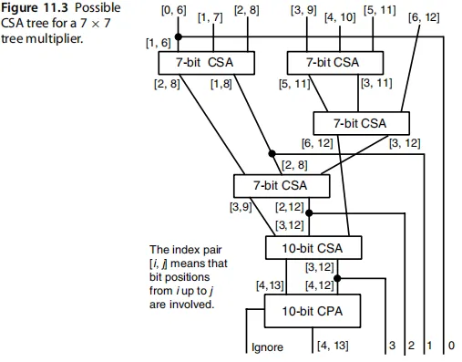
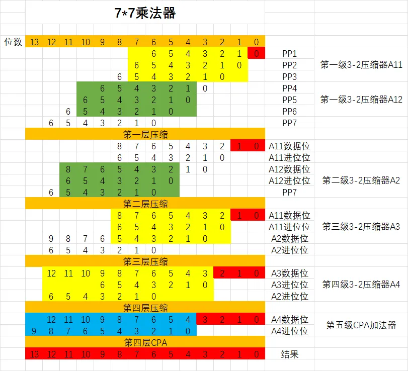

> 参考书籍：Computer-Arithmetic-Algorithms-and-Hardware-Designs-2nd-Edition

# 1、硬件加法基本原理

## 1.1、基础——半加器、全加器与行波进位加法器

单bit的半加器（half-adders）与全加器（full-adders）是用于合成加法器和其他算数电路的基本构建模块。一个HA接受两个输入分别是x和y，输出一个和s和一个进位c。

HA的门级实现如上图所示，有三种不同的实现方法。

与HA不同的是，单bit的FA接受三个输入，分别是输入x和y以及上一级的进位cin，输出是和s与进位cout。一个FA可以通过使用两个HAs和一个OR门实现，示意图如下：

在常规的运算中，通常不会只对单bit的值进行计算，因此，我们需要拓展FA以完成对多bit数的加法计算，最常见的拓展是行波进位加法器，即把上一个全加器的输出进位位cout连接到下一个全加器的输入进位位cin，这样就形成了一个最基础的行波进位加法器。

## 1.2、Carry-Lookahead Adders

相较于行波进位加法器，可以优化时序路径。

待补充……

## 1.3、多操作数加法

在上面两节，我们讨论了两个操作数的加法，即`s=x+y`，但在实现乘法器或各种算法时，加法的输入操作数通常不只有2个，这种情况下，如果仍然使用行波加法器，会需要很多次加法逻辑，使得计算变得缓慢。

为了获得更快的速度，可以使用双操作数加法器的树形结构如下所示：

这样的一个二进制加法器树需要n-1个加法器。尽管这看着很奇怪，但是在上图中的Adder部分使用简单且缓慢的行波进位加法器是最好的选择，其结构如下所示：

## 1.4、Carry-save Adder

我们可以将一行二进制FAs看作是将三个加数减少为两个加数的一种方式，这种情况下，FA就变成了保存进位加法器即CSA。

CSA其实就是FA的另一种叫法，CSA的计算与FA的计算如下：

上方所示的即是FA的计算过程，采用了行波进位加法器的计算方式，同时计算两个加数和一个进位位。下方所示的CSA的计算过程，即3-2压缩器，顾名思义，将三个加数转化为了两个输出，上面一行点是当前CSA的输出值，下面一行是CSA的进位值。

同样，为了适应多操作数的计算，可以用加法器树的方式将几个CSAs连接在一起，以完成将数个加法数最终压缩为两个加法数：

上图所示的CSA树将7个k-bit的操作数减少到了2个(k+2)bit的操作数且结果相同，这样的树形结构被称为7输入的华莱士树。由此，可以进一步的引申为：

**一个**`**n**`**输入通道的华莱士树可以将其**`**k-bit**`**的输入减少为2个**`**(k+log****2****n-1)-bit**`**的输出。**

华莱士树的算法如上所示，一共需要一个7-bit的加法器，28个FAs和一个HA。因为每个CSA将操作数的数量减少了1.5倍，所以一个n-input的华莱士树所需要的最小层数为：

$ h(n)=1+h(2n/3) $

另一种查看数量和树高之间的关系是找到可以被h-level树减少到2个操作数的输入的数量`n(h)`：

$ n(h)= \lfloor 3n(h-1)/2 \rfloor $

h-level树的操作数最大输入数n为：

当层数为3时，所需要的操作数最多为6个，而wallace树将其化为了5个，而高速加法器的延迟通常不是一个关于位宽平滑增长的函数，例如11bits到32bits的CLA可能有相同的延迟。所以没有必要将操作数的数量化简的小于下一层的最大值，只需要用最少的FA和HA化简使得其值等于最大值即可。基于这种思想，Dadda改进了wallce树：

由于在最后使用的加法器是CPA加法器，因此，在加法器的最后一位可以有一个进位位，为了对该加法器进行最大化的利用，可以将上面几层树结构中的FA改成HA，这样就会在最后一层留下一个进位位数，其算法原理如下所示：

这就是改进后的Dadda树加法器。

# 2、硬件乘法基本原理

## 2.1、无符号数乘法

假设a为被乘数，x为乘数，p为乘积：

上图所展示的是两个4bit无符号数用点来表示的乘法过程。因为x0的值只能是0或者1，所以部分积xja的值只能是0或者a，由此，二进制乘法就会被转化为一组数字（0或a）的移位加法。

在硬件上所对应的有两个算法，分别是右移算法和左移算法。右移算法即从最低位算起，先将部分积左移k位，再依次进行右移操作并累加。左移算法即从最高位算起，先算部分积x3a的值，再左移一位，接着加上部分积x2a的值，依次类推，算法的示意图如下：

为了在硬件中实现以上算法，需要用到加法器、移位器和选择器，左移和右移的硬件设计分别如下所示：

需要注意的是，无论是在右移或是左移中，Multilplier和Partial product共享了部分积寄存器。因为在右移/左移算法中，部分积的低/高k位暂时用不到，处于空闲状态，因此可以被Multiplier利用。其中Multiplier占据了寄存器的低/高k位并随着计算进行位移，不会对结果造成影响，可以参照算法示意图进行比对。由此，根据图示，可以直接将部分积的最低位/最高位作为选择器Mux的控制信号。

## 2.2、有符号乘法

前面讨论的都是无符号乘法，而由于加入了有符号数的计算，因此有符号乘法需要考虑的方面更多。

计算有符号数乘法的一种方法是先计算符号位、再使用无符号乘法计算无符号的数值，最后再计算出结果。但由于各种限制，这种方法一般只适用于反码的计算，不适合补码的计算，由此，接下来会讨论补码乘法的计算。

根据计算的方法，可以将补码的乘法分为两种，一种是乘数为正数，另一种是乘数为负数。

当乘数为正数时，计算的过程可以直接套用无符号乘法的计算过程：

当乘数为负数时，由于最高位代表了负数的权重，因此可以在上述基础上，在最后一个周期减去xk-1a而不是加，其算法过程如下所示：

根据以上算法，可以得到硬件实现如下所示，该硬件乘法与无符号的乘法器基本上相同：

注意到该硬件乘法器在右下角处添加了一个信号，只在乘数为负数的最后一个周期为一，为加法器Adder提供进位并控制多路选择器Mux选择被乘数的值。也就是加上了xk-1a的补码（按位取反，末位加一）。

## 2.3、Booth编码

处理补码数的另一种方法是使用**Booth编码**来表示乘数x的有符号形式。

Booth编码最初被提出是为了加速早期计算机中的radix-2乘法。在乘法器中，单独的移位比加法后移位要快，也就代表着：乘数中的1越多，乘法的速度越慢。Booth编码此时就可以很好的解决这个问题。基2Booth乘法器的数学推导可以看这篇文章（[【HDL系列】乘法器(5)——Radix-2 Booth乘法器 - 知乎 (zhihu.com)](https://zhuanlan.zhihu.com/p/136087729)），这里不做过多介绍。

基2Booth编码表如上所示。从编码表可以看出Booth编码主要是处理连续的1，当输入序列为`0111110`时，经Booth编码可得`10000-10`，可以看到，1的数量经Booth编码后显著减少。

以下是Booth编码的乘法算数过程：

与上述相反，当输入为`10101`时，Booth编码得到的结果比原来更加复杂，似乎违背了原始的初衷，这是因为radix-2 Booth编码不能很好的解决连续的10变换。

因此radix-2 Booth编码很少用于乘法器的实现中，乘法器的实现一般会选择radix-4 Booth编码版本。

## 2.4、快速乘法器设计

快速乘法器的设计目前主要有两个方面：

1. 减少需要被加的操作数（利用编码减少1的个数）。
2. 增加加法的速度

# 3、High-Radix Multipliers

一个k位的二进制数可以被表示为为一个k/2位的radix-4数，一个k/3位的radix-8数，以此类推。使用high-radix乘法基本上需要在每个周期中处理超过1位的乘法器。

## 3.1、radix-4乘法器

对于给定的数字范围，表示的radix越大，数字越少。因此，如果我们采用更高的radices，一次乘法运算就需要更少的周期。本节主要介绍了high-radix乘法算法的意义。

根据以上算法可以构建乘法器硬件结构如下所示：

radix-4乘法器的乘数可以是0，a，2a，3a，需要根据Multiplier的低两位选择相应的操作数送入加法器中，`3a`是通过`2a+a`提前计算好的。

此外，如果采用另一种方法将`3a`用`4a+(-a)`来代替的话，因为radix为4，所以当检测到3a时，将3a替换成向下一位的进位与`(-a)`，下一位的进位用一个FF保存：

radix-8，radix-16的乘法器同理。

## 3.2、改进Booth编码

在上一节介绍了基于Booth编码的radix-2乘法器，但是这种乘法器并不能很好的适配radix-4乘法器，所以在本小节提出了一种改进的radix-4 Booth编码，该编码可以将范围在[0,3]之间的数转换为范围在[-2,2]之间的数，以下是一个无符号数转换成有符号数值的示例：

这里需要注意的是16-bit的无符号数转换成了9-digit的radix-4数。通常来说，当一个k-bit的无符号数的最高位为1时，需要用$ \lfloor k/2 \rfloor+1 $个radix-4的digits数来表示。需要注意的是，默认$ x*{-1} =x_k=x*{k-1}=0 $.

如果k-bit二进制数是以补码形式出现的，那么radix-4版本的Booth编码将会有$ \lceil k/2 \rceil $个digits，转换的示例如下：

$ (10\ 01\ 11\ 01\ 10\ 11\ 10)_{2's-compl}=(-2\ 2\ -1\ 2\ -1\ -1\ 0\ 2)_{four} $

当需要编码的数的个数k为奇数时，为了得到正确的结果，需要假设$ x*{k}=x*{k-1} $，Radix-4的Booth编码表如下所示：

这样的Booth编码可以避免出现radix-4的值为3从而简化了硬件的设计，Radix-4 Booth乘法器的硬件部署如下：

可以看到，编码器的逻辑并不是直接给出编码值，而是给出三个bits来编码：`neg`、`two`和`non0`，这三个bits的作用是：

`non0`：用于分辨当前编码值是否为0，不为0则该值为1，否则置0.

`neg`：用于判断非零值的正负值，负数为1，正数为0.

`two`：用于判断非零值的范围，2会被编码为1，1会被编码为0.

通过这种方式，可以将编码的5个值（0，±1，±2）用3个bits来表示。

## 3.3、树形乘法器

### 3.3.1、Full-tree Multiplier

在乘法器的设计中，最简单的形式是使用并行或满树（full-tree）乘法器。其中，所有乘数的k倍都会立刻生成，同时，会使用一个k输入的CSA树来将操作数减少至两个。因为所有的倍数都是一次合并的，所以该树不需要反馈路径，使得流水化成为可能。

以上就是满树乘法器的结构图，主要可以分为三个部分，分别为：乘数生成电路、部分积压缩树（CSA）、冗余数转二进制表示（不懂）。

压缩树有两种选择，一种是wallace树，另一种是dadda树，这两种方法各有优劣。Wallace树是在最开始的时候只要有机会就将部分积结合，这样得到的树在设计上是最快的，而Dadda树是尽可能地将combine推后，这样可以使得CSA树的关键路径最短，CSA树最简单且CPA更长。

两个用不同CSA树实现的4×4的树型乘法器如下：

从上图可以看出，左边的Wallace-tree在一开始选择了将尽可能多的位数压缩，因此，使用HA和FA压缩了n为2、3、4的通道；而Dadda-tree则在最上层只压缩会超过层数限制（1层为2、2层为3、3层为4，见前文）的通道。因此，最终实现的效果是在最上两层，Dadda-tree使用的FAs和HAs少于Wallace-tree，而最底层由于右二通道未完全压缩为1，所以使用了一个更宽的加法器来实现加法。

采用华莱士树的7×7树乘法器的可能的结构如下所示：

由于该树在一开始就尽可能的对操作数进行化简，因此，我们可以大致认为该树是一个基于Wallace树实现的树型乘法器，其具体实现过程如下表格所示：

红色的框表示最终输出的结果，黄色与绿色的框表示CSA，蓝色的框表示CPA。

由于基于CSA的压缩树具有不规则的结构，这使得其设计和布局相当困难，此外不同长度的连接线和信号会导致逻辑冒险和信号偏差，这对性能和功耗都有着较大的影响。在VLSI设计中，将尽可能的从迭代或者递归的结构中构建电路，以便自动综合和布局。

### 3.3.2、Alternative Reduction Trees
